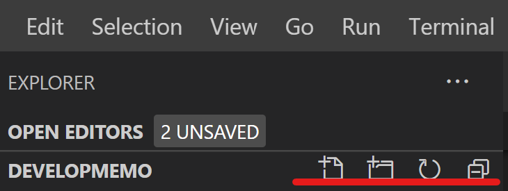

# VS Code を初めて使う人用の説明

## VS Codeの位置づけ

VS Code では単一のファイルを開いて編集するテキストエディタの側面と、
フォルダを開いてワークスペースとしてプロジェクトを開発できる統合開発環境の側面がある。  
ワークスペースとして扱うとそのフォルダだけでの設定ができる
（A フォルダでは javascript+html なプロジェクトで適した拡張を入れる、
B フォルダでは C#を開発するため別の拡張を入れたり専用のデバッグ構成をする、等）

## ワークスペースを開く
フォルダを右クリック＞ Code で開く

フォルダのショートカットに対しても効くのでデスクトップにショートカットを置いておくと便利

## 初期設定

- `The 'Remote - WSL' extension is...` がうるさい場合
  - <kbd>⚙</kbd>
  - <kbd>Don't show again</kbd>
  - <kbd>No</kbd>

## コマンド操作

- <kbd>F1</kbd>でコマンドパレット表示
- `>コマンド`でコマンドを実行(>は勝手に入力されている)  
  コマンドの検索結果が下に表示されるので <kbd>↓</kbd>かクリックで選択
- `ファイル名`でファイル名検索したり開いたりできる
- `:行番号`で指定の行にジャンプできる  
  `ファイル名:行番号`も可能

## ファイル操作

右クリックでだいたい直感的に操作可能  
または

左から新規ファイル・新規フォルダ・更新・階層をたたむ